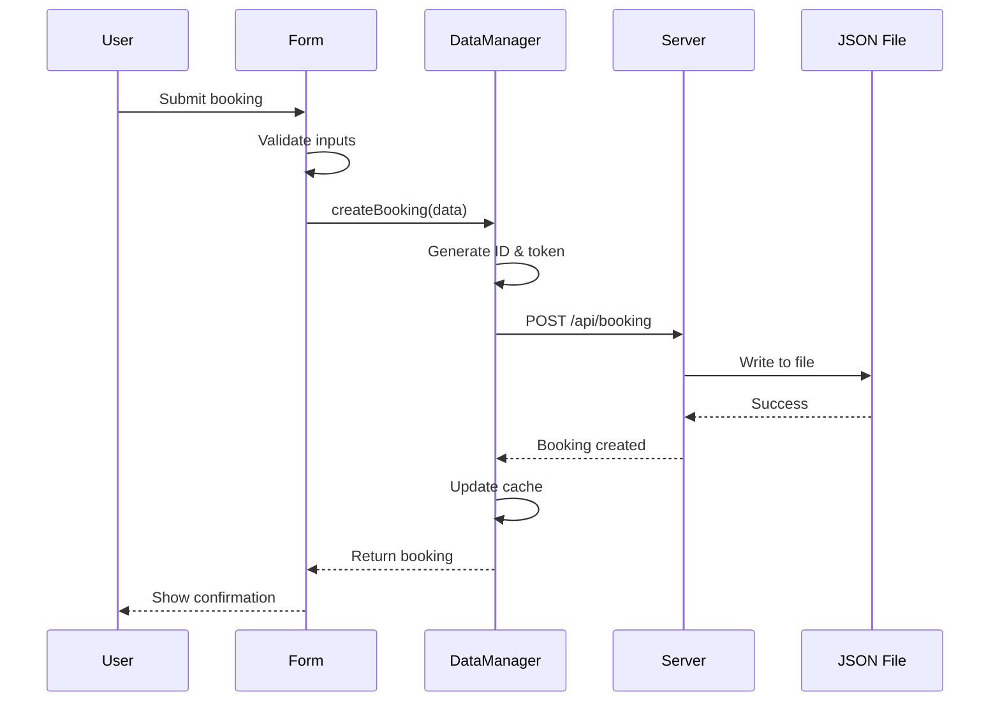
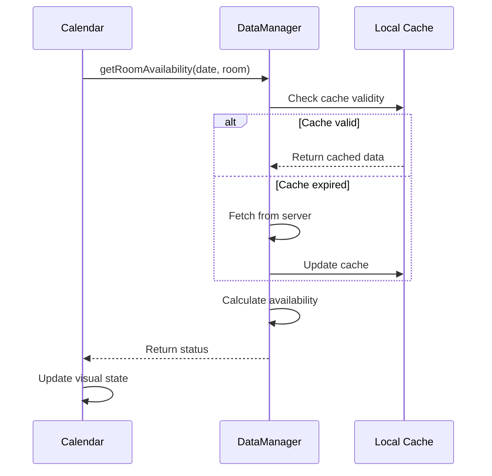

# System Architecture

## Overview

The Mariánská Reservation System follows a **Progressive Web App (PWA)** architecture with offline capabilities, combining a lightweight Node.js backend with a responsive SPA frontend.

```
┌─────────────────────────────────────────────┐
│                   Users                      │
├──────────────┬─────────────┬────────────────┤
│   Guests     │    Admin    │   Editors      │
└──────┬───────┴──────┬──────┴────────┬───────┘
       │              │               │
┌──────▼──────────────▼───────────────▼───────┐
│            Frontend (SPA)                    │
│  ┌─────────┬──────────┬──────────────────┐  │
│  │ Booking │ Calendar │ Administration   │  │
│  │  Form   │  View    │   Dashboard      │  │
│  └────┬────┴────┬─────┴──────┬───────────┘  │
│       └─────────▼────────────┘               │
│           DataManager                        │
│         (Dual Storage)                       │
└────────────┬───────────┬─────────────────────┘
             │           │
    ┌────────▼───────┐   │
    │  Express API   │   │
    │   (server.js)  │   │
    └────────┬───────┘   │
             │           │
    ┌────────▼───────┐   │
    │  File Storage  │   │
    │ (bookings.json)│   │
    └────────────────┘   │
                         │
                ┌────────▼───────┐
                │  LocalStorage  │
                │   (Fallback)   │
                └────────────────┘
```

## Core Components

### Backend Layer

#### Express Server (`server.js`)

- **Port**: 3000
- **Middleware**: CORS, JSON parser, static files
- **Endpoints**: RESTful API for CRUD operations
- **Storage**: JSON file persistence
- **Concurrency**: Single-threaded with async I/O

#### Data Persistence

```javascript
// File structure
data/
└── bookings.json
    ├── bookings[]      // Reservation records
    ├── blockedDates[]  // Maintenance blocks
    └── settings{}      // System configuration
```

### Frontend Layer

#### DataManager Pattern

Central orchestrator implementing **Repository Pattern** for data abstraction:

```javascript
class DataManager {
  // Dual storage strategy
  async getData() {
    try {
      return await this.fetchFromServer();
    } catch {
      return this.getFromLocalStorage();
    }
  }
}
```

#### Component Architecture

**Modular Design** with clear separation of concerns:

```
booking-app.js (Orchestrator)
    ├── calendar.js (View)
    ├── booking-form.js (Controller)
    └── data.js (Model/Repository)
```

### Data Flow

#### Booking Creation Flow



#### Availability Check Flow



## State Management

### Client State

**Distributed State** across components:

```javascript
// Calendar State
{
  currentMonth: { year: 2024, month: 3 },
  selectedDates: ["2024-03-15", "2024-03-16"],
  selectedRooms: ["12", "13"],
  roomAvailability: Map<date, Map<room, status>>
}

// Form State
{
  step: 1,
  formData: { name, email, phone, ... },
  validation: { email: true, phone: false, ... },
  calculatedPrice: 1500
}

// DataManager State
{
  cachedData: { bookings, blockedDates, settings },
  lastSync: timestamp,
  syncInterval: 30000,
  isOnline: true
}
```

### Server State

**Centralized State** in JSON file:

```javascript
{
  bookings: [
    {
      id: "BK1234567890",
      status: "confirmed",
      version: 1,           // Optimistic locking
      createdAt: "...",
      updatedAt: "..."
    }
  ],
  blockedDates: [...],
  settings: {
    version: "1.0.0",
    lastModified: "..."
  }
}
```

## Synchronization Strategy

### Online Mode

- **Auto-sync**: Every 30 seconds
- **Immediate push**: On data modification
- **Conflict resolution**: Last-write-wins
- **Retry logic**: Exponential backoff

### Offline Mode

- **LocalStorage**: Full data mirror
- **Queue changes**: Store pending operations
- **Sync on reconnect**: Flush queue to server
- **Conflict handling**: Manual resolution UI

## Security Architecture

### Data Protection

```
┌─────────────────────────────┐
│      Security Layers        │
├─────────────────────────────┤
│  1. Input Validation        │
│  2. Token-based Access      │
│  3. Admin Authentication    │
│  4. Rate Limiting (planned) │
│  5. HTTPS (production)      │
└─────────────────────────────┘
```

### Access Control

| Feature          | Public | Editor | Admin |
| ---------------- | ------ | ------ | ----- |
| View Calendar    | ✅     | ✅     | ✅    |
| Create Booking   | ✅     | ✅     | ✅    |
| Edit Own Booking | ✅\*   | ✅     | ✅    |
| Delete Booking   | ❌     | ❌     | ✅    |
| Block Dates      | ❌     | ❌     | ✅    |
| Manage Settings  | ❌     | ❌     | ✅    |

\*With edit token

## Performance Optimizations

### Frontend

- **Lazy rendering**: Only visible calendar month
- **Virtual scrolling**: Large booking lists
- **Debounced inputs**: 300ms validation delay
- **Memoized calculations**: Price computation cache
- **Batch DOM updates**: RequestAnimationFrame

### Backend

- **In-memory cache**: Frequent data reads
- **Async I/O**: Non-blocking file operations
- **JSON streaming**: Large dataset handling
- **Compression**: Gzip for responses
- **Static file caching**: 1 year for assets

### Network

- **HTTP/2**: Multiplexed connections
- **CDN**: Static assets (production)
- **Service Worker**: Offline caching (planned)
- **WebSocket**: Real-time updates (planned)

## Scalability Considerations

### Current Limitations

- **Single server**: No horizontal scaling
- **File storage**: I/O bottleneck at scale
- **No queuing**: Direct request processing
- **Memory bound**: All data in memory

### Scaling Path

#### Phase 1: Optimize Current

- Add Redis caching
- Implement connection pooling
- Add request queuing
- Optimize file I/O

#### Phase 2: Database Migration

```sql
-- Proposed schema
CREATE TABLE bookings (
  id VARCHAR(15) PRIMARY KEY,
  data JSONB,
  created_at TIMESTAMP,
  updated_at TIMESTAMP
);

CREATE INDEX idx_bookings_dates ON bookings((data->>'startDate'));
CREATE INDEX idx_bookings_email ON bookings((data->>'email'));
```

#### Phase 3: Microservices

```
┌──────────────┐  ┌──────────────┐  ┌──────────────┐
│   Booking    │  │   Calendar   │  │    Admin     │
│   Service    │  │   Service    │  │   Service    │
└──────┬───────┘  └──────┬───────┘  └──────┬───────┘
       └─────────────────┼─────────────────┘
                         │
                  ┌──────▼───────┐
                  │  API Gateway  │
                  └──────────────┘
```

## Deployment Architecture

### Docker Setup

```yaml
services:
  app:
    ├── Node.js 18
    ├── Express server
    └── Volume: ./data

  nginx:
    ├── Reverse proxy
    ├── SSL termination
    └── Static caching
```

### Production Environment

```
┌─────────────────┐
│   CloudFlare    │  CDN + DDoS Protection
└────────┬────────┘
         │
┌────────▼────────┐
│   Load Balancer │  Health checks
└────────┬────────┘
         │
┌────────▼────────┐
│   Web Servers   │  Multiple instances
└────────┬────────┘
         │
┌────────▼────────┐
│   Data Store    │  Persistent volume
└─────────────────┘
```

## Monitoring & Observability

### Metrics Collection

- **Application**: Response times, error rates
- **System**: CPU, memory, disk I/O
- **Business**: Bookings/day, occupancy rate

### Logging Strategy

```javascript
// Structured logging
{
  timestamp: "2024-03-15T10:00:00Z",
  level: "info",
  service: "booking",
  action: "create",
  userId: "anonymous",
  duration: 125,
  metadata: { ... }
}
```

### Health Checks

```javascript
GET /health
{
  status: "healthy",
  uptime: 86400,
  version: "1.0.0",
  checks: {
    database: "ok",
    storage: "ok",
    memory: "ok"
  }
}
```

## Disaster Recovery

### Backup Strategy

- **Frequency**: Every 6 hours
- **Retention**: 30 days
- **Location**: Off-site storage
- **Testing**: Monthly restore drill

### Recovery Procedures

1. **Data corruption**: Restore from backup
2. **Service failure**: Docker restart
3. **Complete failure**: Redeploy from Git
4. **Data loss**: Restore from LocalStorage cache

## Future Enhancements

### Short Term (3 months)

- [ ] Add PostgreSQL database
- [ ] Implement WebSocket updates
- [ ] Add Service Worker for PWA
- [ ] Create automated backups

### Medium Term (6 months)

- [ ] Multi-language support
- [ ] Email notifications
- [ ] Payment integration
- [ ] Mobile app

### Long Term (12 months)

- [ ] Multi-property support
- [ ] Revenue management system
- [ ] Channel manager integration
- [ ] Analytics dashboard
