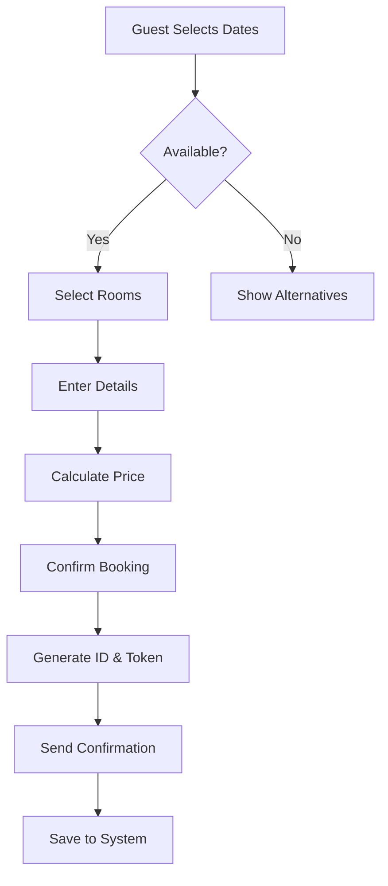
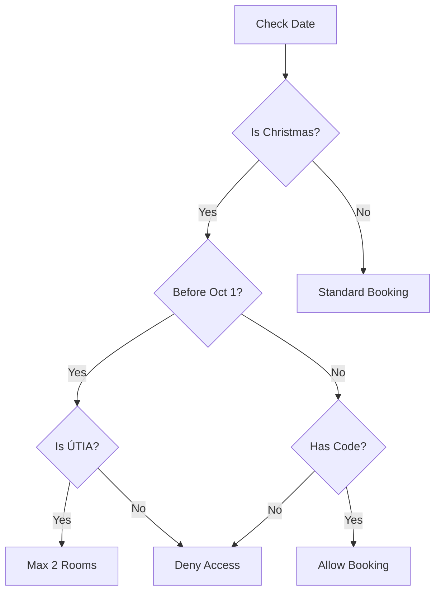

# Business Rules Documentation

## 🏠 Property Overview

### Chata Mariánská

- **Location**: Mountain lodge
- **Capacity**: 26 beds
- **Rooms**: 9 rooms across 3 floors
- **Target**: ÚTIA employees + External guests

## 🛏️ Room Configuration

### Floor Layout

```
Floor 1 (Přízemí)
├── Room 12: 2 beds (Small)
├── Room 13: 3 beds (Large)
└── Room 14: 4 beds (Large)

Floor 2 (1. patro)
├── Room 22: 2 beds (Small)
├── Room 23: 3 beds (Large)
└── Room 24: 4 beds (Large)

Floor 3 (2. patro)
├── Room 42: 2 beds (Small)
├── Room 43: 2 beds (Small)
└── Room 44: 4 beds (Large)

Total: 26 beds
- Small rooms (2 beds): 4 rooms
- Large rooms (3-4 beds): 5 rooms
```

### Room Categories

| Type  | Beds | Rooms              | Base Occupancy      |
| ----- | ---- | ------------------ | ------------------- |
| Small | 2    | 12, 22, 42, 43     | 2 adults            |
| Large | 3-4  | 13, 14, 23, 24, 44 | 2 adults + children |

## 💰 Pricing Structure

### Base Prices (per night)

#### ÚTIA Employees

```
Small Room (2 beds):
  Base price: 300 Kč
  + 50 Kč per additional adult
  + 25 Kč per child (3-15 years)
  + 0 Kč per toddler (0-3 years)

Large Room (3-4 beds):
  Base price: 400 Kč
  + 50 Kč per additional adult
  + 25 Kč per child (3-15 years)
  + 0 Kč per toddler (0-3 years)
```

#### External Guests

```
Small Room (2 beds):
  Base price: 500 Kč
  + 100 Kč per additional adult
  + 50 Kč per child (3-15 years)
  + 0 Kč per toddler (0-3 years)

Large Room (3-4 beds):
  Base price: 600 Kč
  + 100 Kč per additional adult
  + 50 Kč per child (3-15 years)
  + 0 Kč per toddler (0-3 years)
```

### Price Calculation Formula

```javascript
totalPrice = nights × (basePrice + additionalCharges)

where:
  additionalCharges =
    (adults - baseOccupancy) × adultPrice +
    children × childPrice

  baseOccupancy = 2 (all rooms)
```

### Example Calculations

**ÚTIA Employee - Family Weekend**

- Room: 14 (Large, 4 beds)
- Guests: 2 adults + 2 children
- Nights: 2
- Calculation:
  ```
  Base: 400 Kč
  Children: 2 × 25 = 50 Kč
  Per night: 450 Kč
  Total: 2 × 450 = 900 Kč
  ```

**External Guest - Couple Getaway**

- Room: 12 (Small, 2 beds)
- Guests: 2 adults
- Nights: 3
- Calculation:
  ```
  Base: 500 Kč
  Additional: 0 Kč
  Per night: 500 Kč
  Total: 3 × 500 = 1,500 Kč
  ```

## 🎄 Christmas Period Rules

### Standard Period

- **Start**: December 23
- **End**: January 2
- **Duration**: 11 days

### Access Control

#### Phase 1: Priority Booking (Until September 30)

- **ÚTIA Employees Only**
- **Maximum**: 1-2 rooms per employee
- **Requirement**: Valid employment status

#### Phase 2: Open Booking (From October 1)

- **All Users**: With valid access code
- **No Room Limit**: Based on availability
- **Code Distribution**: Via ÚTIA administration

### Access Code System

```javascript
// Christmas booking validation
if (isChristmasPeriod(date)) {
  if (date < '2024-09-30') {
    // ÚTIA employees only, max 2 rooms
    requireUTIAStatus = true;
    maxRooms = 2;
  } else {
    // Anyone with valid code
    requireAccessCode = true;
  }
}
```

### Code Management

- **Format**: XMAS2024, VIP123, etc.
- **Validity**: Entire Christmas period
- **Distribution**: Email to eligible users
- **Admin Control**: Add/remove codes anytime

## 📅 Booking Rules

### Time Constraints

| Rule            | Description           | Implementation   |
| --------------- | --------------------- | ---------------- |
| Advance Booking | Max 1 year ahead      | Current year + 1 |
| Minimum Stay    | No restriction        | 1 night allowed  |
| Maximum Stay    | 14 consecutive nights | Soft limit       |
| Check-in        | After 14:00           | Information only |
| Check-out       | Before 10:00          | Information only |

### Availability Rules

```javascript
// Room is available if:
function isAvailable(date, roomId) {
  return (
    !isBooked(date, roomId) &&
    !isBlocked(date, roomId) &&
    date >= today() &&
    date <= maxBookingDate()
  );
}
```

### Booking Modifications

#### With Edit Token

- **What**: All booking details
- **When**: Until check-in date
- **How**: Via edit.html?token=XXX

#### Without Token

- **Contact**: Admin required
- **Verification**: Email + phone
- **Changes**: Limited modifications

### Cancellation Policy

| Period          | Refund | Penalty            |
| --------------- | ------ | ------------------ |
| > 7 days before | 100%   | None               |
| 3-7 days before | 50%    | 50% charge         |
| < 3 days before | 0%     | Full charge        |
| No-show         | 0%     | Full charge + flag |

## 🚫 Blocking Rules

### Admin Blocking

**Reasons for Blocking:**

- Maintenance/repairs
- Private events
- Seasonal closure
- Emergency situations

**Block Types:**

```javascript
// Specific room
blockDate('2024-03-15', '12', 'Maintenance');

// All rooms
blockDate('2024-12-31', null, "New Year's Eve");

// Date range
blockDateRange('2024-07-01', '2024-07-07', ['12', '13'], 'Renovation');
```

### Automatic Blocks

- Past dates (cannot book history)
- System maintenance windows
- Exceeded capacity scenarios

## 👥 Guest Categories

### ÚTIA Employees

- **Verification**: Email domain check (@utia.cas.cz)
- **Benefits**:
  - Discounted rates (40-50% off)
  - Priority Christmas booking
  - Extended payment terms

### External Guests

- **Requirements**: Full payment upfront
- **Restrictions**:
  - No Christmas priority
  - Standard rates apply
  - Limited to available inventory

### Special Categories

#### Researchers/Collaborators

- Treated as ÚTIA employees with approval
- Requires admin verification
- Time-limited access

#### Group Bookings

- **Definition**: > 3 rooms
- **Process**: Contact admin directly
- **Pricing**: Potential group discount
- **Payment**: 50% deposit required

## 📊 Capacity Management

### Occupancy Limits

| Room           | Adults | Children | Total Max |
| -------------- | ------ | -------- | --------- |
| Small (2 beds) | 2      | 1        | 3         |
| Large (3 beds) | 3      | 2        | 4\*       |
| Large (4 beds) | 4      | 2        | 5\*       |

\*With extra bedding

### Overbooking Prevention

```javascript
// Validation before booking
function validateCapacity(rooms, guests) {
  const totalBeds = calculateTotalBeds(rooms);
  const totalGuests = adults + children;

  if (totalGuests > totalBeds) {
    if (toddlers > 0 && totalGuests <= totalBeds + toddlers) {
      return true; // Toddlers don't need beds
    }
    return false; // Over capacity
  }
  return true;
}
```

## 🔄 Business Process Flows

### Standard Booking Flow



### Christmas Booking Flow



## 📈 Revenue Optimization

### Dynamic Pricing Factors

- **Seasonality**: Summer +20%, Winter +10%
- **Occupancy**: >80% triggers surge pricing
- **Length of Stay**: 7+ nights = 10% discount
- **Advance Booking**: 30+ days = 5% discount

### Yield Management

```javascript
// Future implementation
function calculateDynamicPrice(basePrice, factors) {
  let price = basePrice;

  price *= factors.seasonMultiplier;
  price *= factors.occupancyMultiplier;
  price *= factors.lengthDiscount;
  price *= factors.advanceDiscount;

  return Math.round(price);
}
```

## 📝 Legal & Compliance

### Data Requirements

**Mandatory Fields:**

- Full name
- Email address
- Phone number
- Address (street, city, ZIP)

**Optional Fields:**

- Company name
- IČO (Company ID)
- DIČ (Tax ID)

### GDPR Compliance

- Data retention: 3 years
- Purpose: Booking management
- Access: On request
- Deletion: After retention period

### Tax Implications

- Prices include VAT
- Invoice available on request
- Corporate billing supported
