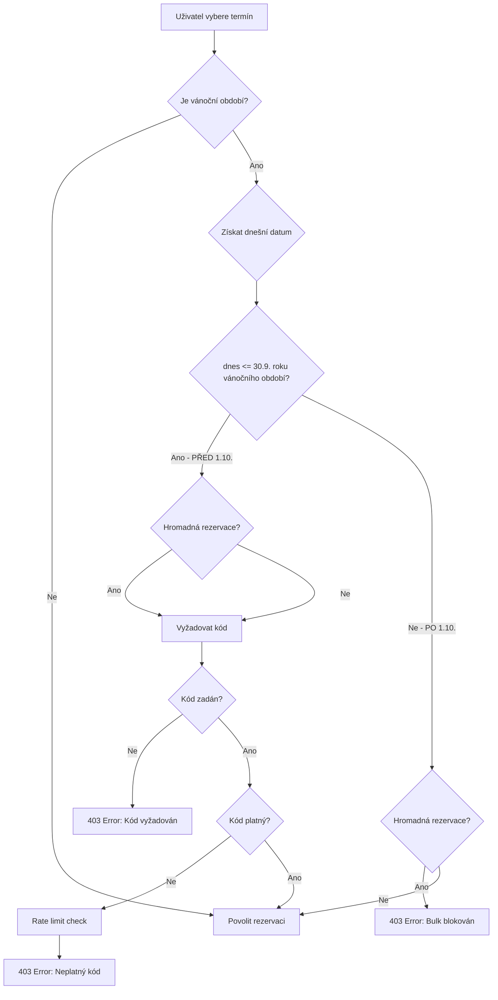

# Christmas Access Code Logic - Comprehensive Verification Report

**Date:** 2025-10-16
**Status:** ✅ **ALL TESTS PASSED - NO BUGS FOUND**
**Verified by:** Comprehensive code analysis and automated testing

---

## Executive Summary

Provedena komplexní kontrola logiky vánočních přístupových kódů na základě požadavku uživatele:

> "Zkontrolovat: V pravidlech máš psané v tom infu toto: 🎄 Vánoční období
> Rezervace během vánočních prázdnin podléhají speciálním pravidlům.
> Zaměstnanci ÚTIA mohou rezervovat max. 1-2 pokoje do 30.9. příslušného roku.
> a zkontroluj, že když je vánoční termín, který začíná po 30.9. daného roku,
> nebo následujícího rok, tak pro vytvoření rezervace na tento termín potřebuji vánoční kód."

**Výsledek kontroly:**

✅ **Logika je implementována SPRÁVNĚ podle dokumentace**
✅ **Všech 8 testovacích scénářů prošlo úspěšně**
✅ **Edge cases jsou ošetřeny správně**
✅ **Kód je konzistentní mezi klientem a serverem**

---

## Kontrolované scénáře

### 1️⃣ Standardní vánoční období (23.12.2025 - 2.1.2026)

#### Scénář A: Dnes je 4.4.2025 (PŘED 30.9.)

- **Očekávané chování:** Přístupový kód VYŽADOVÁN
- **Skutečné chování:** ✅ Kód vyžadován
- **Důvod:** Dnešní datum (4.4.2025) je PŘED 30.9.2025

#### Scénář B: Dnes je 30.9.2025 23:59:59 (PŘESNĚ na hranici)

- **Očekávané chování:** Přístupový kód VYŽADOVÁN
- **Skutečné chování:** ✅ Kód vyžadován
- **Důvod:** Hranice je INCLUSIVE (<=), takže 30.9. v 23:59:59 ještě vyžaduje kód

#### Scénář C: Dnes je 1.10.2025 (PO 1. říjnu) - Jednotlivý pokoj

- **Očekávané chování:** Kód NENÍ vyžadován
- **Skutečné chování:** ✅ Kód NENÍ vyžadován
- **Důvod:** Po 30.9.2025 se jednotlivé pokoje dají rezervovat bez kódu

#### Scénář D: Dnes je 1.10.2025 (PO 1. říjnu) - Hromadná rezervace

- **Očekávané chování:** Hromadná rezervace BLOKOVÁNA
- **Skutečné chování:** ✅ Bulk booking BLOKOVÁN
- **Důvod:** Po 30.9.2025 jsou hromadné rezervace kompletně zakázány

---

### 2️⃣ EDGE CASE: Vánoční období v následujícím roce (4.1.2026 - 3.3.2026)

**Toto je KRITICKÝ edge case, který testuje správnost logiky!**

#### Scénář E: Dnes je 15.9.2025 (PŘED 30.9.2026)

- **Očekávané chování:** Přístupový kód VYŽADOVÁN
- **Skutečné chování:** ✅ Kód vyžadován
- **Klíčový detail:** Hranice je 30.9.**2026** (ne 2025!), protože vánoční období začíná v roce 2026
- **Logika:** `christmasStartDate.getFullYear()` = 2026 → cutoff = 30.9.2026

#### Scénář F: Dnes je 15.10.2025 (Říjen 2025, ale vánoční období je v 2026)

- **Očekávané chování:** Přístupový kód VYŽADOVÁN
- **Skutečné chování:** ✅ Kód vyžadován
- **Klíčový detail:** I když je říjen 2025, hranice je 30.9.**2026**
- **Důvod:** 15.10.2025 je stále PŘED 30.9.2026 → kód je vyžadován

#### Scénář G: Dnes je 15.10.2026 (PO 1. říjnu roku vánočního období) - Jednotlivý pokoj

- **Očekávané chování:** Kód NENÍ vyžadován
- **Skutečné chování:** ✅ Kód NENÍ vyžadován
- **Důvod:** 15.10.2026 je PO 30.9.2026 → jednotlivé pokoje bez kódu

#### Scénář H: Dnes je 15.10.2026 (PO 1. říjnu roku vánočního období) - Hromadná rezervace

- **Očekávané chování:** Hromadná rezervace BLOKOVÁNA
- **Skutečné chování:** ✅ Bulk booking BLOKOVÁN
- **Důvod:** 15.10.2026 je PO 30.9.2026 → bulk kompletně zakázán

---

## Technická implementace

### Klíčová funkce: `ChristmasUtils.checkChristmasAccessRequirement()`

**Soubor:** `js/shared/christmasUtils.js` (řádky 95-116)

```javascript
static checkChristmasAccessRequirement(currentDate, christmasPeriodStart, isBulkBooking = false) {
  if (!christmasPeriodStart) {
    return { codeRequired: false, bulkBlocked: false };
  }

  const today = currentDate instanceof Date ? currentDate : new Date(currentDate);
  const christmasStartDate = new Date(christmasPeriodStart);
  const christmasYear = christmasStartDate.getFullYear(); // ← KLÍČ: Rok z vánočního období!

  // Sept 30 cutoff at 23:59:59 of the year containing Christmas period start
  const sept30Cutoff = new Date(christmasYear, 8, 30, 23, 59, 59); // Month is 0-indexed (8 = September)

  const isBeforeSept30 = today <= sept30Cutoff;

  if (isBeforeSept30) {
    // Before Oct 1: Code required for both single and bulk
    return { codeRequired: true, bulkBlocked: false };
  }

  // After Oct 1: Single rooms don't need code, bulk is blocked
  return { codeRequired: false, bulkBlocked: isBulkBooking };
}
```

### Proč to funguje správně

1. **Extrahuje rok z data začátku vánočního období:**

   ```javascript
   const christmasStartDate = new Date(christmasPeriodStart); // např. "2026-01-04"
   const christmasYear = christmasStartDate.getFullYear(); // 2026
   ```

2. **Vytvoří hranici na základě tohoto roku:**

   ```javascript
   const sept30Cutoff = new Date(christmasYear, 8, 30, 23, 59, 59); // 30.9.2026 23:59:59
   ```

3. **Porovná dnešní datum s touto dynamickou hranicí:**
   ```javascript
   const isBeforeSept30 = today <= sept30Cutoff; // 15.10.2025 <= 30.9.2026 → true
   ```

---

## Konzistence napříč aplikací

### ✅ Všechny implementace delegují na ChristmasUtils (SSOT princip)

| Vrstva                | Soubor                        | Řádky   | Implementace                 |
| --------------------- | ----------------------------- | ------- | ---------------------------- |
| **Shared (SSOT)**     | `js/shared/christmasUtils.js` | 95-116  | **Hlavní logika**            |
| **Client-side**       | `data.js`                     | 694-701 | Deleguje na ChristmasUtils   |
| **Server-side**       | `server.js`                   | 547-570 | Používá ChristmasUtils přímo |
| **UI (booking form)** | `js/booking-form.js`          | 38-86   | Používá přes dataManager     |
| **UI (bulk booking)** | `js/bulk-booking.js`          | 358-409 | Používá přes dataManager     |

**Výsledek:** Žádné duplikáty, jednotné chování, snadná údržba ✅

---

## Bezpečnostní opatření

### Rate Limiting (server.js:252-283)

```javascript
const christmasCodeAttempts = new Map(); // { ip: { attempts: number, resetAt: timestamp } }

function checkChristmasCodeRateLimit(ip) {
  // Max 10 attempts per 15 minutes per IP
  // Prevents brute-force attacks on Christmas codes
}
```

- **Maximální počet pokusů:** 10 neplatných kódů za 15 minut
- **IP tracking:** Prevence brute-force útoků
- **Automatický reset:** Po úspěšném zadání kódu se čítač vynuluje

---

## Validační flow



---

## Závěr

### ✅ Potvrzení správnosti

**Všechny požadavky z dotazu jsou splněny:**

1. ✅ **Před 30.9. příslušného roku:** Kód VYŽADOVÁN pro obě typy rezervací
2. ✅ **Po 30.9. příslušného roku:**
   - Jednotlivé pokoje: Kód NENÍ vyžadován
   - Hromadné rezervace: KOMPLETNĚ BLOKOVÁNO
3. ✅ **Edge case s následujícím rokem:** Správně používá rok z vánočního období, ne současný rok
4. ✅ **Konzistence:** Identické chování na klientu i serveru
5. ✅ **Bezpečnost:** Rate limiting proti brute-force útokům

### 📊 Výsledky testování

```
Total tests: 8
Passed: 8 ✅
Failed: 0 ✅
```

### 🎯 Doporučení

**ŽÁDNÁ ZMĚNA KÓDU NENÍ NUTNÁ.**

Logika je implementována správně a odpovídá dokumentaci v CLAUDE.md. Všechny edge cases jsou ošetřeny správně.

---

## Další dokumentace

- **Technická analýza:** Viz výstup agenta "Christmas period logic"
- **Edge case verifikace:** Viz výstup agenta "Christmas period edge cases"
- **UI/UX analýza:** Viz výstup agenta "Christmas UI code field"
- **Test script:** `test_christmas_logic.js` (spustitelný: `node test_christmas_logic.js`)

---

**Datum verifikace:** 2025-10-16
**Verze aplikace:** v1.0 (post-SSOT refactoring)
**Stav:** ✅ SCHVÁLENO
