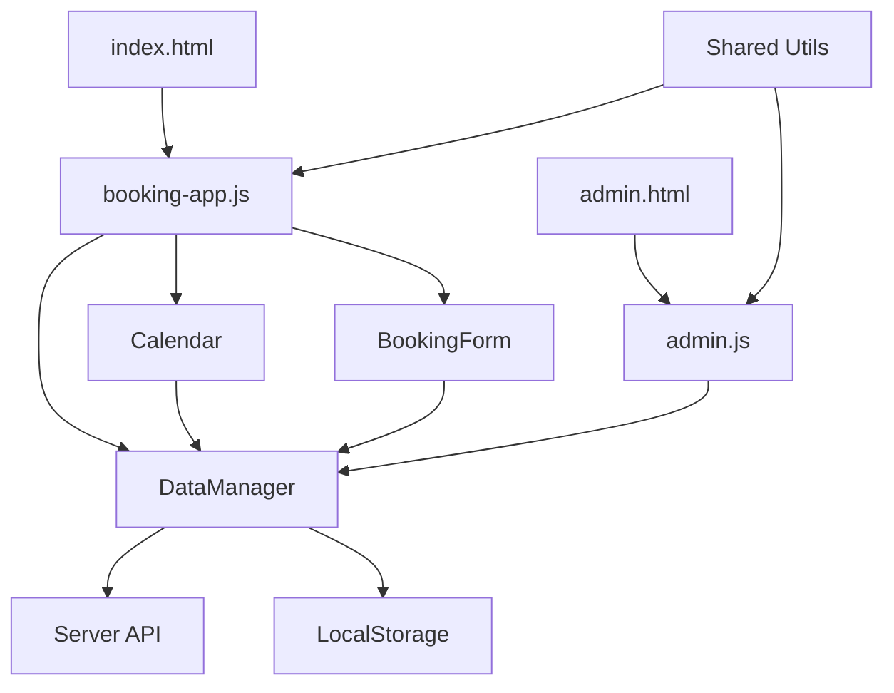

# Component Documentation

## Core Modules

### 📦 DataManager (`data.js`)

Central data management and business logic orchestrator.

#### Key Methods

| Method                              | Purpose                     | Parameters               | Returns                  |
| ----------------------------------- | --------------------------- | ------------------------ | ------------------------ |
| `initData()`                        | Initialize storage and sync | None                     | Promise<void>            |
| `createBooking(data)`               | Create new reservation      | Booking data             | Promise<{id, editToken}> |
| `updateBooking(id, updates)`        | Update existing booking     | id, partial data         | Promise<Booking>         |
| `deleteBooking(id)`                 | Remove booking              | Booking ID               | Promise<void>            |
| `getRoomAvailability(date, roomId)` | Check room status           | Date, Room ID            | Promise<boolean>         |
| `calculatePrice(params)`            | Compute booking cost        | Guest type, rooms, dates | Number                   |
| `isChristmasPeriod(date)`           | Check if date is Christmas  | Date string              | Promise<boolean>         |
| `blockDate(date, roomId)`           | Block date/room             | Date, Room ID (optional) | Promise<void>            |

#### Storage Modes

1. **Server Mode** (Primary)
   - API calls to Express backend
   - Persistent file storage
   - Auto-sync every 30 seconds

2. **LocalStorage Mode** (Fallback)
   - Client-side storage
   - Key: `chataMarianska`
   - Offline capability

---

### 📅 Calendar Component (`js/calendar.js`)

Interactive calendar with availability visualization.

#### Features

- **Multi-room view** - All rooms displayed in grid
- **Color coding** - Unique colors per booking email
- **Date selection** - Click to select/deselect dates
- **Visual states**:
  - 🟢 Available (green)
  - 🔴 Occupied (red + email color)
  - ⬜ Blocked (gray)
  - 🎄 Christmas period (gold border)

#### Methods

| Method                     | Purpose               | Usage               |
| -------------------------- | --------------------- | ------------------- |
| `initCalendar()`           | Initialize calendar   | Called on page load |
| `renderMonth(year, month)` | Display month view    | Navigation          |
| `selectDate(date)`         | Toggle date selection | User interaction    |
| `updateAvailability()`     | Refresh room states   | After data changes  |
| `getSelectedDates()`       | Get user selection    | Form submission     |

#### Events

```javascript
// Listen for date selection
document.addEventListener('dateSelected', (e) => {
  const { date, rooms } = e.detail;
  // Handle selection
});

// Listen for calendar navigation
document.addEventListener('monthChanged', (e) => {
  const { year, month } = e.detail;
  // Update UI
});
```

---

### 📝 Booking Form (`js/booking-form.js`)

Two-step reservation form with real-time validation.

#### Step 1: Reservation Details

- Date range selection
- Room selection with capacity check
- Guest type (ÚTIA/External)
- Guest count (adults/children/toddlers)
- Automatic price calculation

#### Step 2: Contact & Billing

- Personal information
- Company details (optional)
- Real-time field validation
- Final price confirmation

#### Validation Rules

| Field | Rule                     | Error Message                        |
| ----- | ------------------------ | ------------------------------------ |
| Email | Must contain @           | "Email musí obsahovat @"             |
| Phone | +420/421 + 9 digits      | "Telefon musí mít 9 číslic"          |
| ZIP   | Exactly 5 digits         | "PSČ musí mít přesně 5 číslic"       |
| IČO   | 8 digits (optional)      | "IČO musí mít 8 číslic"              |
| DIČ   | CZ + 8 digits (optional) | "DIČ musí být ve formátu CZ12345678" |

#### Form Events

```javascript
// Form submission
bookingForm.on('submit', async (formData) => {
  const booking = await dataManager.createBooking(formData);
  showConfirmation(booking);
});

// Validation
bookingForm.on('validate', (field) => {
  const isValid = validateField(field);
  updateFieldUI(field, isValid);
});
```

---

### 🎛️ Admin Dashboard (`admin.js`)

Comprehensive management interface with tabbed navigation.

#### Tabs & Functionality

1. **Rezervace (Bookings)**

   ```javascript
   -listBookings() - // Display all reservations
     viewBooking(id) - // Show booking details
     editBooking(id) - // Modify reservation
     deleteBooking(id) - // Remove booking
     exportData(); // Download JSON/CSV
   ```

2. **Blokované dny (Blocked Dates)**

   ```javascript
   -blockDateRange(start, end, rooms) -
     unblockDate(date, roomId) -
     listBlockedDates() -
     setBlockReason(reason);
   ```

3. **Vánoční přístup (Christmas Access)**

   ```javascript
   -setChristmasPeriod(start, end) -
     manageAccessCodes(codes) -
     validateAccessCode(code) -
     listChristmasBookings();
   ```

4. **Nastavení (Settings)**

   ```javascript
   -updatePrices(guestType, roomType, prices) -
     configureRooms(rooms) -
     changeAdminPassword(newPassword) -
     updateEmailSettings(config);
   ```

5. **Statistiky (Statistics)**
   ```javascript
   -calculateOccupancy(period) -
     getTotalRevenue(startDate, endDate) -
     getAverageStayLength() -
     getGuestTypeDistribution();
   ```

---

## Shared Utilities

### 🔧 Calendar Utils (`js/shared/calendarUtils.js`)

```javascript
// Date manipulation
formatDateCZ(date); // "15. 3. 2024"
parseCzechDate(dateStr); // Date object
getDaysInMonth(year, month); // Number
isWeekend(date); // Boolean
getWeekNumber(date); // ISO week number
```

### 📏 Validation Utils (`js/shared/validationUtils.js`)

```javascript
// Input validation
validateEmail(email); // Boolean
validatePhone(phone); // Boolean
validateZIP(zip); // Boolean
validateICO(ico); // Boolean
validateDIC(dic); // Boolean
sanitizeInput(input); // Cleaned string
```

### 💰 Price Calculator (`js/shared/priceCalculator.js`)

```javascript
// Pricing logic
calculateNightPrice(roomType, guestType);
calculateAdditionalGuests(adults, children);
calculateTotalPrice(params);
applyDiscounts(price, discountCodes);
formatPriceCZK(amount); // "1 500 Kč"
```

### 🆔 ID Generator (`js/shared/idGenerator.js`)

```javascript
// Unique identifiers
generateBookingId(); // "BK1234567890ABC"
generateEditToken(); // "abc123def456"
generateBlockageId(); // "BLK1234567890"
generateAccessCode(); // "XMAS2024"
```

### 📅 Date Utils (`js/shared/dateUtils.js`)

```javascript
// Date operations
formatDate(date); // "2024-03-15"
addDays(date, days); // New Date
getDaysBetween(start, end); // Number
isDateInRange(date, start, end); // Boolean
getDateArray(start, end); // Date[]
```

---

## Component Integration Flow



## Event Flow

1. **User Opens Page**
   - DataManager.initData()
   - Calendar.render()
   - Form.initialize()

2. **User Selects Dates**
   - Calendar → dateSelected event
   - Form updates with selection
   - Price calculation triggered

3. **User Submits Booking**
   - Form validation
   - DataManager.createBooking()
   - Server sync
   - Confirmation display

4. **Admin Updates Data**
   - Admin action
   - DataManager update
   - Server push
   - Calendar refresh

## State Management

### Client State

```javascript
{
  selectedDates: [],
  selectedRooms: [],
  currentMonth: { year, month },
  formData: {},
  validation: {},
  isLoading: false,
  error: null
}
```

### Server State

```javascript
{
  bookings: [...],
  blockedDates: [...],
  settings: {...},
  lastModified: timestamp
}
```

## Performance Optimizations

- **Lazy Loading**: Calendar loads only visible month
- **Debounced Validation**: 300ms delay on input
- **Cached Calculations**: Price computation memoized
- **Batch Updates**: Group DOM modifications
- **Virtual Scrolling**: Large booking lists paginated

## Browser Compatibility

- **Chrome**: 90+ ✅
- **Firefox**: 88+ ✅
- **Safari**: 14+ ✅
- **Edge**: 90+ ✅
- **IE**: ❌ Not supported

## Testing Hooks

```javascript
// Expose for testing
window.__TEST__ = {
  dataManager,
  calendar,
  bookingForm,
  resetState: () => {...},
  mockData: (data) => {...}
};
```
